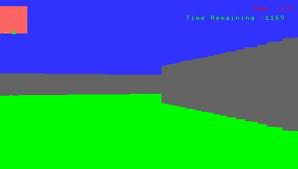

The Labyrinth
===========

Small technical demo written in Lua for PSP

##What's this ?
A minimalistic raycasting engine technical demonstration, based on Sean Connelly's codetank source and *Permadi*'s [tutorial](http://www.permadi.com/tutorial/raycast/).

##Notes
Compatible with PSP Fat and Slim

##Installation Path
ms0:/PSP/GAME/

##License
* *Code* : The MIT License (MIT). Copyright (c) 2009 Roland Y. See [LICENSE](license).

